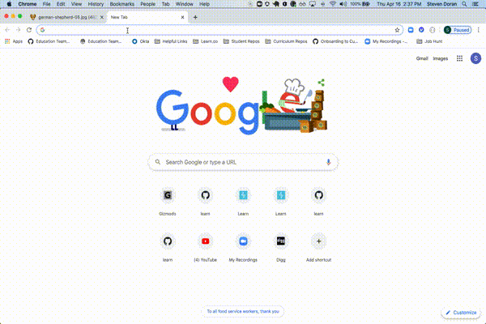

# Module 3 JS Code Challenge

## Objectives

- DOM Manipulation
- Events and Event Handlers
- Callbacks
- Fetching from APIs

## Instructions 🐶

Today, you will be building an app to display and create a collection of puppies. Your app should satisfy the following user stories:

- As a user, when the page loads, I should see a collection of puppy images and their details

- As a user, when I fill out and sumbit the new puppy form that puppy should appear at the bottom of my collection of puppies



## The API

Instead of actually accessing the data from a remote API, this challenge uses a package called [json-server](https://github.com/typicode/json-server) to create a fake API for development and testing.

It is very easy to set-up.

1 - Run the command `npm install -g json-server` in the command line from this directory

2 - Run  `json-server --watch db.json`

That's it. You will have a server running on `localhost:3000` that serves the JSON data contained in the `db.json` file.

*Troubleshooting: If this fails, be sure you don't already have something running on port 3000*

## Deliverables and How to Approach

For this challenge, it is important to work iteratively, one feature at a time, before moving on to the next. You should **prioritize making code that works over attempting all of the deliverables.**

### Step 1 - Display All The Puppies

When the page loads, I should see all of the puppies from the API. 

Each puppy should be attached to the DOM using the following HTML:

```html
<div class="puppy-card">
  
  <div class="puppy-details">
    <h3>*NAME*</h3>
    <p class="age">Age: *AGE* months</p>
    <p class="breed">Breed: *BREED</p>*
    <p class="personality">Personality: *PERSONALITY*</p>
  </div>
</div>
```

The API endpoint we need to retrieve all the puppies is a conventional RESTful route:

* **Route:** GET `http://localhost:3000/puppies`


### Step 2 - Add a New Puppy

When I fill out and submit the new puppy form, a new puppy record should be inserted into the database and a new puppy card should appear at the bottom of the DOM with the details from the form. The new puppy should persist across page reloads.

The API endpoint we need to create a puppy is a conventional RESTful route:

* **Route:** POST `http://localhost:3000/puppies`

## Considerations

You are free to solve this in any way you choose. It is not required that you have ES6 classes or use Object Orientation.
